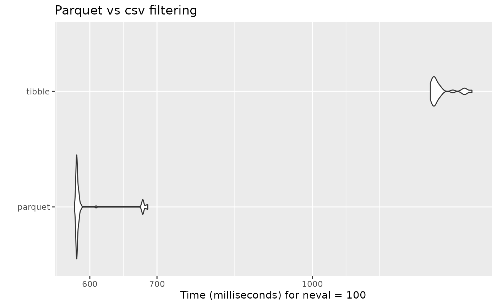

# Working with parquet datasets

Apache Parquet is an open-source data storage format that efficiently
handles large complex data. In contrast to CSV files, `.parquet` files
are column-oriented, making them storage efficient. Additionally, the
columnar storage of parquet files avoids having to read the full
datasets in memory. This last feature of parquet files makes them ideal
to work in R with larger than memory datasets.

Efficiently storing and processing large individual-level data is one
important challenge that researchers commonly face. Although parquet
files (or other column-oriented tabular data) are becoming more popular
in the data-analysis world, they are not as commonly used in research.
For instance, it is still common for Norwegian register microdata
(e.g. NPR) to be delivered as chunked CSVs.

To enable users to work with larger-than-memory data within `regkit`,
the functions
[`read_diag_data()`](https://amslala.github.io/regkit/reference/read_diag_data.md)
`read_demo_data()`
[`filter_diag_data()`](https://amslala.github.io/regkit/reference/filter_diag_data.md)
`filter_demo_data()` support parquet files. This is particularly helpful
to speed-up the filtering steps in very large data sets. In the next
example, it is shown how to write/read parquet datasets and use them as
part of the `regkit` analytical pipeline.

### Writing parquet files

First, we generate a simulated diagnostic dataset with ~8.3 million
rows:

``` r


simulated_list <- synthetic_data(
  population_size = 2100000,
  prefix_ids = "P0",
  length_ids = 8,
  family_codes = c("F45", "F84"),
  pattern = "increase",
  prevalence = .023,
  diag_years  = c(2012:2015),
  sex_vector = c(0, 1),
  y_birth = c(2010:2015),
  filler_codes = "F",
  filler_y_birth = c(2000:2009),
  invariant_codes = list("innvandringsgrunn" = c("ARB", "NRD", "UKJ")),
  invariant_codes_filler = list("innvandringsgrunn" = c("FAMM", "UTD")),
  seed = 12
)
#> ! Varying query and varying codes arguments are empty. The varying dataset will not be generated.
#> ℹ Creating relevant cases with the following characteristics:
#> • Population size = 2100000
#> • Prefix IDs = P0
#> • Length IDs = 8
#> • Diagnostic relevant codes = F45 and F84
#> • Pattern of incidence = increase
#> • Prevalence = 0.023
#> • Diagnostic years = 2012, 2013, 2014, and 2015
#> • Incidence =
#> • Coding sex = 0 and 1
#> • Relevant years of birth = 2010, 2011, 2012, 2013, 2014, and 2015
#> ℹ Creating filler cases with the following characteristics:
#> • Filler diagnostic codes = F
#> • Filler years of birth = 2000, 2001, 2002, 2003, 2004, 2005, 2006, 2007, 2008,
#> and 2009
#> • Pattern for filler incidence = 'random'
#> • Number of filler cases to generate = 1907227
#> ! This process can take some minutes...
#> ✔ Succesfully generated diagnostic and time-invariant datasets!

new_df <- simulated_list$datasets$diag_df
```

We proceed to save the diagnostic dataset as both as .csv and .parquet
files. In the case of parquet files, we will use the function
[`arrow::write_dataset()`](https://arrow.apache.org/docs/r/reference/write_dataset.html):

``` r


# Save as csv 
td <- withr::local_tempdir()
tp_csv <- file.path(td, "new_df.csv")
write.csv(new_df, tp_csv, row.names = FALSE)


# Save as parquet 
tp_parquet <- file.path(td, "new_df.parquet")
arrow::write_dataset(new_df, path = tp_parquet, format = "parquet")
```

For very large datasets, it is also possible to partition the data and
save it across different parquet files. There are no defined guidelines
on how to partition data, as it is highly dependent on the type of data
and structure you have. As a general rule, it is recommended to avoid
creating very small (\<20MB) and very large partitions (\>2GB).
Additionally, it is a good idea to try to partition by any variable you
will use to filter by.

If we are planning to later use the `filter_diag()` function to filter
only the diagnosis given in the years 2012 and 2013, we could partition
by grouping our data by the variable `diag_year`:

``` r


tp_parquet_part <- file.path(td, "new_df_partition.parquet")

new_df |> 
  dplyr::group_by(diag_year) |> 
  arrow::write_dataset(path = tp_parquet_part, format = "parquet")
```

### Reading parquet files

To read a parquet dataset, it is possible to use the
[`read_diag_data()`](https://amslala.github.io/regkit/reference/read_diag_data.md)
as you would with a .csv or .sav files:

``` r

rm(new_df)
l_path <- withr::local_tempfile(fileext = ".log", lines = "Parquet log")

diag_parquet <- read_diag_data(
  file_path = tp_parquet, 
  id_col = "id", 
  date_col = "diag_year",
  code_col = "code",
  log_path = l_path)
#> ℹ You have provided a parquet file or database. Due to the characteristics of these data objects, the console output and logging will provide minimal information.
#> Reading /tmp/RtmpHdUYfm/file7dd658445d04/new_df.parquet file...
#> ✔ Successfully read file: /tmp/RtmpHdUYfm/file7dd658445d04/new_df.parquet
#> Checking column requirements:
#> ✔ ID column
#> ✔ Code column
#> ✔ Date column
#> 
#> ────────────────────────────────────────────────────────────────────────────────
#> Diagnostic dataset successfully read and columns validated
#> 
#> 
#> ── Data Summary ────────────────────────────────────────────────────────────────
#> ℹ Number of rows: 8391376. Number of columns: 3.
#> 
#> 
#> FileSystemDataset with 1 Parquet file
#> 8,391,376 rows x 3 columns
#> $ id       <string> "P000000669", "P000000669", "P000000669", "P000000775", "P00…
#> $ code     <string> "F841", "F0111", "F141", "F843", "F192", "F144", "F451", "F5…
#> $ diag_year <int32> 2012, 2015, 2013, 2014, 2014, 2014, 2014, 2012, 2013, 2013, …
```

### Filtering

As an output from
[`read_diag_data()`](https://amslala.github.io/regkit/reference/read_diag_data.md)
will be ArrowObject (Dataset) that you can then pass to the function
`filter_diag()` to efficiently filter any relevant observations:

``` r


filtered_parquet <- filter_diag_data(
  diag_parquet, 
  pattern_codes = c("F84", "F45"), 
  classification = "icd", 
  id_col = "id", 
  code_col = "code", 
  date_col = "diag_year", 
  diag_dates = c(2012), 
  rm_na = TRUE, 
  log_path = l_path)
#> ℹ Your data is a Arrow dataset, due to nature of this data object the output in the console and log will be minimal.
#> Checking that code exists in ICD-10 or ICPC-2 code list...
#> ✔ Selected codes/pattern are valid: F450, F451, F452, F453, F4530, F4531, F4532, F4533, F4534, F4538, F454, F458, F459, F840, F841, F842, F843, F844, F845, F848, F849
#> Filtering data by selected codes...
#> Filtering observations by date of diagnosis...
#> ! The dataset has no NAs or they are coded in a different format.
#> 
#> ────────────────────────────────────────────────────────────────────────────────
#> Diagnostic dataset successfully filtered
#> 
#> ℹ Filtered 8352662 rows (99.5% removed)
#> 
#> ── Data Summary ────────────────────────────────────────────────────────────────
#> 
#> ── After filtering:
#> ℹ Remaining number of rows: 38714
#> ℹ Remaining number of columns: 3
#> ℹ Unique IDs in dataset: 38459
#> ℹ Unique codes in dataset: 21
#> ℹ Codes in dataset: "F452", "F844", "F4533", "F454", "F849", "F4530", "F848", "F4532", "F450", "F843", "F842", "F840", "F458", "F845", "F841", "F451", "F4531", "F4534", …, "F4538", and "F459"
#> 
#> Rows: 38,714
#> Columns: 3
#> $ id        <chr> "P000000669", "P000023038", "P000097523", "P000108943", "P00…
#> $ code      <chr> "F841", "F4531", "F458", "F454", "F4538", "F4531", "F842", "…
#> $ diag_year <int> 2012, 2012, 2012, 2012, 2012, 2012, 2012, 2012, 2012, 2012, …
```

### Performance

As it is to be expected, the filtering done on the parquet dataset is in
average double as fast than the regular filter done on a tibble or data
frame object:

``` r


diag_tibble <- read_diag_data(
  file_path = tp_csv, 
  id_col = "id", 
  date_col = "diag_year",
  code_col = "code",
  log_path = l_path)


mb_filter <- microbenchmark::microbenchmark(
  parquet = 
    filter_diag_data(
      diag_parquet, 
      pattern_codes = c("F84", "F45"), 
      classification = "icd", 
      id_col = "id", 
      code_col = "code", 
      date_col = "diag_year", 
      diag_dates = c(2012), 
      rm_na = TRUE, 
      log_path = l_path), 
  tibble = 
    filter_diag_data(
      diag_tibble, 
      pattern_codes = c("F84", "F45"), 
      classification = "icd", 
      id_col = "id", 
      code_col = "code", 
      date_col = "diag_year", 
      diag_dates = c(2012), 
      rm_na = TRUE, 
      log_path = l_path), 
  check = NULL
)
```

    #> Unit: milliseconds
    #>     expr       min        lq      mean    median        uq       max neval
    #>  parquet  579.3034  581.9105  597.5571  582.6917  585.0665  685.4128   100
    #>   tibble 1310.8380 1318.5727 1342.7491 1325.5770 1342.2588 1442.1210   100
    #> Warning: `aes_string()` was deprecated in ggplot2 3.0.0.
    #> ℹ Please use tidy evaluation idioms with `aes()`.
    #> ℹ See also `vignette("ggplot2-in-packages")` for more information.
    #> ℹ The deprecated feature was likely used in the microbenchmark package.
    #>   Please report the issue at
    #>   <https://github.com/joshuaulrich/microbenchmark/issues/>.
    #> This warning is displayed once per session.
    #> Call `lifecycle::last_lifecycle_warnings()` to see where this warning was
    #> generated.


