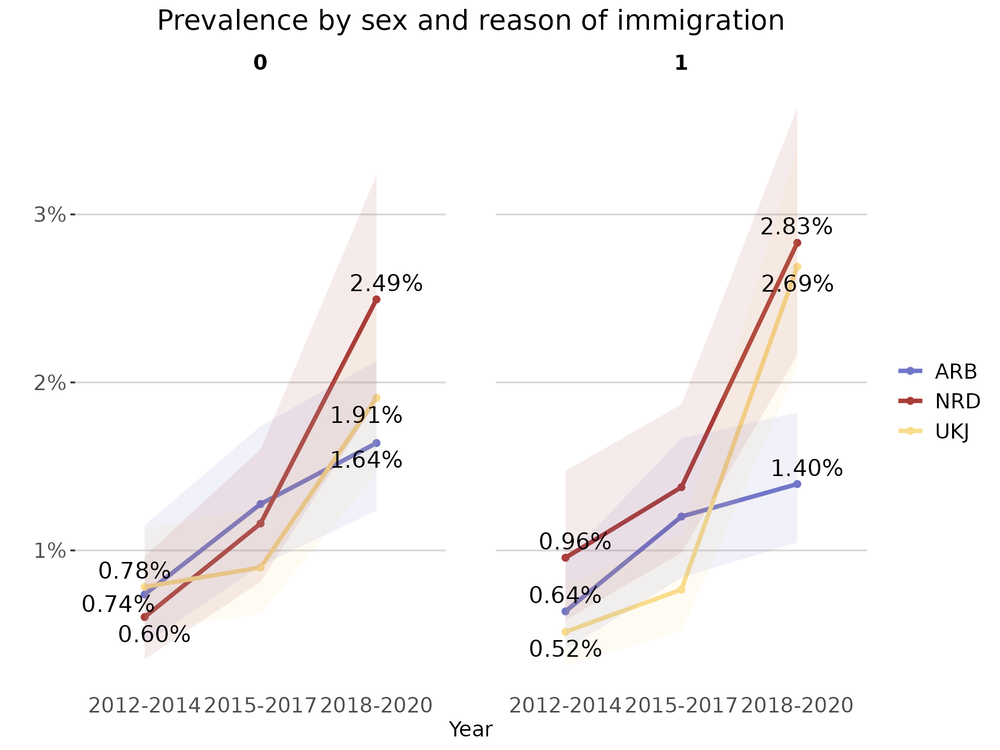
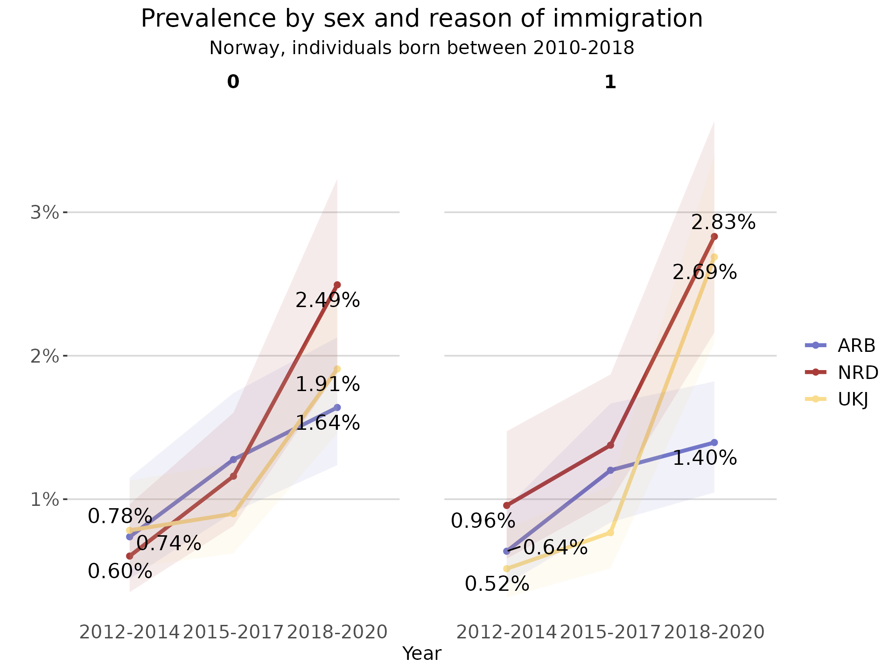

# Introduction to regkit

**regkit** aims to facilitate the manipulation, analysis and
visualization of data from Norwegian health and population registers and
capitalize on their characteristics.

Researchers with access to microdata from health and/or administrative
registers in Norway can use **regkit** to streamline their initial
analytical processes. The package includes functions for data
pre-processing, linkage, and the computation of relevant statistics and
visualizations, such as stratified frequencies, incidence and prevalence
rates.

This vignette introduces **regkit**’s main functions and shows examples
of how to use them with individual-level data. The package also includes
some helper functions that can aid researchers working with registry
data in Norway address specific problems, more information in the
[`vignette("h-functions")`](https://amslala.github.io/regkit/articles/h-functions.md)
and
[`vignette("other-useful-fun")`](https://amslala.github.io/regkit/articles/other-useful-fun.md).

## Example datasets

To exemplify the main functions of the package, we have included a
couple of illustrative simulated datasets. These datasets are also used
in the examples specified in the functions’ documentation.

The dataset `diag_df` is a tibble with simulated individual-level
diagnostic data. It is documented in
[`?diag_df`](https://amslala.github.io/regkit/reference/diag_df.md)

``` r

str(diag_df)
#> tibble [120,256 × 3] (S3: tbl_df/tbl/data.frame)
#>  $ id       : chr [1:120256] "P000000704" "P000000704" "P000000704" "P000000704" ...
#>  $ code     : chr [1:120256] "F4522" "F305" "F65" "F840" ...
#>  $ diag_year: int [1:120256] 2016 2020 2014 2017 2014 2017 2018 2020 2016 2013 ...
```

The dataset `var_df` is a tibble with simulated individual-level
time-varying data. It is documented in
[`?var_df`](https://amslala.github.io/regkit/reference/var_df.md)

``` r

str(var_df)
#> tibble [270,216 × 3] (S3: tbl_df/tbl/data.frame)
#>  $ id          : chr [1:270216] "P000000037" "P000000037" "P000000037" "P000000037" ...
#>  $ year_varying: int [1:270216] 2012 2013 2014 2015 2016 2017 2018 2019 2020 2012 ...
#>  $ varying_code: chr [1:270216] "0815" "0815" "0815" "0815" ...
```

The dataset `invar_df` is a tibble with simulated individual-level
time-invariant data. It is documented in
[`?invar_df`](https://amslala.github.io/regkit/reference/invar_df.md)

``` r

str(invar_df)
#> tibble [30,024 × 4] (S3: tbl_df/tbl/data.frame)
#>  $ id               : chr [1:30024] "P000000037" "P000000052" "P000000059" "P000000111" ...
#>  $ sex              : Factor w/ 2 levels "0","1": 1 1 1 2 2 1 2 1 1 1 ...
#>  $ y_birth          : int [1:30024] 2008 2000 2007 2003 2000 2003 2009 2005 2004 2002 ...
#>  $ innvandringsgrunn: chr [1:30024] "FAMM" "FAMM" "FAMM" "FAMM" ...
```

All the datasets above have been created using the `simulate_dataset()`
function included in this package. The exact code used to create them
can be found in the folder `/data-raw` in the package’s source code. The
`vignette("h_functions")` includes more detailed information about
simulating datasets in `regkit`.

## Logging

To facilitate reproducibility and transparency across research projects,
the majority of functions in **regkit** create log files that document
their internal data processing, warnings/errors and corresponding
outputs. Similarly, each function provides clear console feedback after
it executes important operations (filter, select, join, etc).

It is possible to either provide the path to an already existing .log
file or set the argument `log_path = NULL` (default) to create a new
/log directory and .log file for each function. For instance, the
[`read_diag_data()`](https://amslala.github.io/regkit/reference/read_diag_data.md)
with a `NULL` log_path will first check in the working directory for a
`/log` directory. In case it does not already exist, the `/log`
directory is created in the current working directory and a
\<read_diag_data_dd_mm_yyyy.log\> file is initialized.

In the following examples, we set up and utilize a temporary log file:

``` r

log_file <- tempfile()
cat("Vignette log file", file = log_file)
```

## Data reading and validation

Generally, researchers using Norwegian individual-level registry data
for epidemiological research will access datasets that fall into one of
the following three categories:

- **Diagnostic data:** at least including unique personal identifier
  (ID), date of diagnostic event, and diagnosis code (such as ICD-10 or
  ICPC-2). For instance, datasets from NPR (Norwegian Patient Registry)
  or KPR (Kommunalt pasient- og brukerregister).

- **Time-invariant administrative data:** administrative
  sociodemographic data that does not change for a given individual in
  the population such as date of birth, immigration background, etc.

- **Time-varying administrative data:** administrative sociodemographic
  data that can change for a given individual in the population, such as
  place of residence or marital status. This type of information usually
  is updated quarterly or yearly in administrative registries.

Assuming a researcher would want to compute prevalence rates for a
certain diagnosis stratified by some sociodemographic characteristic(s),
they would at least need a *diagnostic* dataset and at least one
administrative dataset.

The functions
[`read_diag_data()`](https://amslala.github.io/regkit/reference/read_diag_data.md)
and
[`read_admin_data()`](https://amslala.github.io/regkit/reference/read_admin_data.md)
check the datasets’ minimum requirements given the users expectations
about what they contain, read them into memory, and give a quick summary
of their structure. For example, in the case of a dataset the user has
identified as containing *time-invariant* data, it is assumed that each
row in the dataset corresponds to a individual identified by a unique
personal identifier. To allow the package to check that the dataset
meets minimum requirements for being useable *time-invariant* data, it
is necessary for the user to specify some of the column names - i.e.,
corresponding to the id or date variables (see the function
documentation for more info).

  

📝 **Note**: these functions only check for *minimum* requirements;
datasets may contain additional variables/columns. For example,
*diagnostic data* sometimes includes sex and age information for each
individual, even though these are not minimally required for this data
type.

  

The `read_..._data()` functions support common file formats that
researchers might realistically encounter in data deliveries, such as
CSV, SAV, and *parquet* files. Parquet files are specially useful when
working with very large data, as the storage and data processing is more
efficient than other types of file formats (e.g. CSV files). As
explained in the `vignette("parquet-files")`, using parquet files is
recommended for large and larger-than-memory data within **regkit**. The
vignette also includes general instructions on how to write/save parquet
datasets.

### Read example diagnostic data

To read and validate the minimum requirements of a CSV file containing
*diagnostic data*:

``` r

diag_csv <- system.file("extdata", "diag_data.csv", package = "regkit")

diag_data_validated <- regkit::read_diag_data(
  diag_csv,
  id_col = "id",
  date_col = "diag_year",
  log_path = log_file
)
#> Reading /home/runner/.cache/R/renv/library/regkit-7ae0198c/linux-ubuntu-noble/R-4.6/x86_64-pc-linux-gnu/regkit/extdata/diag_data.csv file...
#> ✔ Successfully read file: /home/runner/.cache/R/renv/library/regkit-7ae0198c/linux-ubuntu-noble/R-4.6/x86_64-pc-linux-gnu/regkit/extdata/diag_data.csv
#> Checking column requirements:
#> ✔ ID column
#> ✔ Code column
#> ✔ Date column
#> 
#> ────────────────────────────────────────────────────────────────────────────────
#> Diagnostic dataset successfully read and columns validated
#> 
#> 
#> ── Data Summary ────────────────────────────────────────────────────────────────
#> ℹ Number of rows: 120256. Number of columns: 3.
#> 
#> 
#> Rows: 120,256
#> Columns: 3
#> $ id        <chr> "P000000704", "P000000704", "P000000704", "P000000704", "P00…
#> $ code      <chr> "F4522", "F305", "F65", "F840", "F728", "F450", "F187", "F73…
#> $ diag_year <int> 2016, 2020, 2014, 2017, 2014, 2017, 2018, 2020, 2016, 2013, …
```

### Read example administrative data

Similarly, to read and validate the minimum requirements of a CSV file
containing *time invariant data*:

``` r

demo_csv <- system.file("extdata", "invar_data.csv", package = "regkit")

demo_data_validated <- read_admin_data(
  demo_csv,
  data_type = "t_invariant",
  id_col = "id",
  log_path = log_file
)
#> Reading /home/runner/.cache/R/renv/library/regkit-7ae0198c/linux-ubuntu-noble/R-4.6/x86_64-pc-linux-gnu/regkit/extdata/invar_data.csv file...
#> ✔ Successfully read file: /home/runner/.cache/R/renv/library/regkit-7ae0198c/linux-ubuntu-noble/R-4.6/x86_64-pc-linux-gnu/regkit/extdata/invar_data.csv
#> Checking column requirements:
#> ✔ ID column
#> Data type: time invariant. Checking requirements...
#> ✔ No duplicate IDs
#> 
#> ────────────────────────────────────────────────────────────────────────────────
#> Administrative (sociodemographic) dataset successfully read and columns validated
#> 
#> 
#> ── Data Summary ────────────────────────────────────────────────────────────────
#> ℹ Number of rows: 30024. Number of columns: 4.
#> ℹ Unique IDs in dataset: 30024.
#> 
#> 
#> Rows: 30,024
#> Columns: 4
#> $ id                <chr> "P000000037", "P000000052", "P000000059", "P00000011…
#> $ sex               <int> 0, 0, 0, 1, 1, 0, 1, 0, 0, 0, 1, 1, 0, 1, 1, 0, 1, 1…
#> $ y_birth           <int> 2008, 2000, 2007, 2003, 2000, 2003, 2009, 2005, 2004…
#> $ innvandringsgrunn <chr> "FAMM", "FAMM", "FAMM", "FAMM", "UTD", "FAMM", "UTD"…
```

In the case of CSV, RDS/RDA, and SAV files, the resulting output is a
tibble that can be further passed as input to other functions in the
package. For parquet files/datasets, the output is an ArrowObject that
can be used as input in the filtering functions described in the section
below. For more information about ArrowObject, please consult the
documentation from the package `arrow`.

## Data filtering

Usually, individual-level register data has a large number of
observations which makes it cumbersome to manipulate and prepare for
analysis. For that reason, it is advantageous to follow a ‘filter first’
approach and remove non-relevant variables and observations.

As mentioned in the `vignette("parquet-files")`, parquet files are more
efficient than other type of files at performing operations on large
datasets. Therefore, both the
[`filter_diag_data()`](https://amslala.github.io/regkit/reference/filter_diag_data.md)
and
[`filter_admin_data()`](https://amslala.github.io/regkit/reference/filter_admin_data.md)
functions are more memory efficient when providing an ArrowObject as an
input (see section above).

Regardless of the input’s data type (ArrowObject or tibble), the output
of these functions are tibbles. It is assumed that after the initial
filtering of both diagnostic and sociodemographic data, the datasets
will be smaller and easier for users to manipulate as in-memory tibbles.

ℹ️ **Variables and codes?**

In order to correctly use the `filter_..._data` functions, it is
necessary to have previous knowledge of the data sources and variables
used. In most cases, data deliveries from registry sources are
accompanied with metadata documentation for each dataset. In the case
that the specific project metadata is not available, here are some
useful starting points:

- **SSB**: [Statistical Classifications and Codelists
  (Klass)](https://www.ssb.no/klass/),
  [Metadata](https://www.ssb.no/a/metadata/), [Variable
  lists](https://www.ssb.no/data-til-forskning/utlan-av-data-til-forskere/variabellister).

- **Health data**: [Helsedata](https://helsedata.no/no/),
  [FinnKode](https://finnkode.helsedirektoratet.no), [Norwegian
  Institute of Public Health](https://www.fhi.no/he/)

### Filter diagnostic data

Due to the distinct characteristics of *diagnostic* and
*time-varying/time-invariant* datasets, there are two filtering
functions:
[`filter_diag_data()`](https://amslala.github.io/regkit/reference/filter_diag_data.md)
and
[`filter_admin_data()`](https://amslala.github.io/regkit/reference/filter_admin_data.md).
The former checks that the ICD-10 or ICPC-2 codes/family or codes given
by the user (`codes` argument) are currently codes reported to
[NPR](https://finnkode.helsedirektoratet.no/icd10/chapter) or
[KPR](https://finnkode.helsedirektoratet.no/icpc2/chapter). Afterwards,
it filters the given diagnostic dataset to keep only the observations
with the relevant ICD-10 or ICPC-2 codes. Additionally, it is possible
to filter by date of the diagnostic event and remove all rows with
missing data.

⚠️ Sometimes the diagnostic data might contain some subcodes not of
mandated reporting to NPR or KPR, therefore the
[`filter_diag_data()`](https://amslala.github.io/regkit/reference/filter_diag_data.md)
throws a warning instead of an error when the codes given by the user
are not found in the list of current valid and reported codes to NPR or
KPR. In that case, it is **important** to verify the validity of the
exact codes given in alternative sources, such as
[FinnKode](https://finnkode.helsedirektoratet.no).

For example, to keep only the observations that either have the ICD-10
code *F840* or *F841*, between the years of 2016 and 2017:

``` r

filtered_diag_codes <- filter_diag_data(
  data = diag_df,
  codes = c("F840", "F841"),
  classification = "icd",
  id_col = "id",
  code_col = "code",
  date_col = "diag_year",
  diag_dates = c("2016", "2017"),
  log_path = log_file
)
#> Checking that code exists in ICD-10 or ICPC-2 code list...
#> ✔ Selected codes/pattern are valid: F840, F841
#> Filtering data by selected codes...
#> Filtering observations by date of diagnosis...
#> ! The dataset has no NAs or they are coded in a different format.
#> 
#> ────────────────────────────────────────────────────────────────────────────────
#> Diagnostic dataset successfully filtered
#> 
#> ℹ Filtered 120209 rows (100% removed)
#> 
#> ── Data Summary ────────────────────────────────────────────────────────────────
#> 
#> ── After filtering:
#> ℹ Remaining number of rows: 47
#> ℹ Remaining number of columns: 3
#> ℹ Unique IDs in dataset: 47
#> ℹ Unique codes in dataset: 2
#> ℹ Codes in dataset: "F840" and "F841"
#> 
#> Rows: 47
#> Columns: 3
#> $ id        <chr> "P000000704", "P000010584", "P000244118", "P000296001", "P00…
#> $ code      <chr> "F840", "F840", "F840", "F840", "F840", "F841", "F840", "F84…
#> $ diag_year <chr> "2017", "2016", "2016", "2017", "2017", "2016", "2017", "201…
```

Alternatively, it is also possible to filter by pattern/family of codes.
For example, to keep the observations with all valid ICD-10 codes
starting with *F45* or *F84* use the argument `pattern_codes` instead of
`codes`. Additionally, the `add_description` argument adds a column
containing a short description of the diagnostic code.

``` r

filtered_diag_pattern <- filter_diag_data(
  data = diag_df,
  pattern_codes = c("F45", "F84"),
  classification = "icd",
  id_col = "id",
  code_col = "code",
  add_description = TRUE,
  log_path = log_file
)
#> Checking that code exists in ICD-10 or ICPC-2 code list...
#> ✔ Selected codes/pattern are valid: F450, F451, F452, F453, F4530, F4531, F4532, F4533, F4534, F4538, F454, F458, F459, F840, F841, F842, F843, F844, F845, F848, F849
#> Filtering data by selected codes...
#> ! The dataset has no NAs or they are coded in a different format.
#> 
#> ────────────────────────────────────────────────────────────────────────────────
#> Diagnostic dataset successfully filtered
#> 
#> ℹ Filtered 117717 rows (97.9% removed)
#> 
#> ── Data Summary ────────────────────────────────────────────────────────────────
#> 
#> ── After filtering:
#> ℹ Remaining number of rows: 2539
#> ℹ Remaining number of columns: 5
#> ℹ Unique IDs in dataset: 2464
#> ℹ Unique codes in dataset: 28
#> ℹ Codes in dataset: "F4520", "F454", "F840", "F845", "F4529", "F456", "F4541", "F841", "F4522", "F844", "F842", "F849", "F457", "F846", "F455", "F452", "F45", "F847", …, "F459", and "F843"
#> 
#> Rows: 2,539
#> Columns: 5
#> $ id                             <chr> "P000000704", "P000000704", "P000000886…
#> $ code                           <chr> "F4522", "F840", "F450", "F845", "F4520…
#> $ diag_year                      <int> 2016, 2017, 2017, 2020, 2019, 2016, 201…
#> $ `Tekst uten lengdebegrensning` <chr> NA, "Barneautisme", "Somatiseringslidel…
#> $ `Tekst med maksimalt 60 tegn`  <chr> NA, "Barneautisme", "Somatiseringslidel…
```

  

ℹ️ **Curate diagnostic data**

For some analyses, it will be necessary to further filter the diagnostic
dataset. For example, if one is interested in the age of first diagnosis
for a chronic disease, only the first registered diagnosis information
is relevant. Or, sometimes it is desirable to only keep cases with more
than a certain number of registered diagnostic events. To accomplish
this type of summarization and curation of the diagnostic dataset, the
[`curate_diag_data()`](https://amslala.github.io/regkit/reference/curate_diag_data.md)
provides some additional filtering options. It is important to highlight
that this function only supports data frames (preferably tibbles) as
input.

For example, to summarize information by first-time diagnosis:

``` r

curated_diag <- curate_diag_data(
  data = filtered_diag_pattern,
  min_diag = 1,
  first_diag = TRUE,
  id_col = "id",
  code_col = "code",
  date_col = "diag_year",
  log_path = log_file
)
#> ✔ Filtered observations that do not have at least 1 diagnostic event
#> ✔ Summarized first diagnostic event information
#> 
#> ────────────────────────────────────────────────────────────────────────────────
#> Diagnostic dataset successfully curated and summarized
#> 
#> ℹ Filtered 75 rows (3% removed)
#> 
#> ── Data Summary ────────────────────────────────────────────────────────────────
#> 
#> ── After filtering:
#> ℹ Remaining number of rows: 2464
#> ℹ Remaining number of columns: 6
#> ℹ Unique IDs in dataset: 2464
#> ℹ ICD-10 codes in dataset: F4520, F454, F845, F4529, F456, F844, F842, F841, F849, F455, F4541, F45, F4522, F457, F847, F848, F840, F451, …, F846, and F843
#> 
#> tibble [2,464 × 6] (S3: tbl_df/tbl/data.frame)
#>  $ id                          : chr [1:2464] "P000000704" "P000000882" "P000000886" "P000001615" ...
#>  $ code                        : chr [1:2464] "F4522" "F454" "F450" "F845" ...
#>  $ y_diagnosis_first           : int [1:2464] 2016 2014 2017 2020 2017 2020 2017 2020 2020 2019 ...
#>  $ diagnosis_count             : int [1:2464] 2 1 1 1 1 1 1 1 1 1 ...
#>  $ Tekst uten lengdebegrensning: chr [1:2464] NA "Vedvarende somatoform smertelidelse" "Somatiseringslidelse" "Aspergers syndrom" ...
#>  $ Tekst med maksimalt 60 tegn : chr [1:2464] NA "Vedvarende somatoform smertelidelse" "Somatiseringslidelse" "Aspergers syndrom" ...
```

### Filter time-varying and time-invariant data

Similar to the filtering of diagnostic data,
[`filter_admin_data()`](https://amslala.github.io/regkit/reference/filter_admin_data.md)
aids with the filtering of both time-varying and time-invariant
datasets.

For example, to only keep observations where the individuals have
resided in the municipality “0815” between the years 2012 and 2015:

``` r

filtered_var <- filter_admin_data(
  data = var_df,
  data_type = "t_variant",
  filter_param = list("year_varying" = c(2012:2015), "varying_code" = c("0815")),
  log_path = log_file
)
#> Filtering time-variant dataset...
#> ✔ Filtered time-variant by 'year_varying and varying_code' column(s)
#> ℹ Filtered 269594 rows (99.8% removed)
#> ! The dataset has no NAs or they are coded in a different format.
#> 
#> ────────────────────────────────────────────────────────────────────────────────
#> administrative (sociodemographic) dataset successfully filtered
#> 
#> 
#> ── Data Summary ────────────────────────────────────────────────────────────────
#> 
#> ── After filtering:
#> ℹ Remaining number of rows: 622
#> ℹ Remaining number of columns: 3
#> 
#> Rows: 622
#> Columns: 3
#> $ id           <chr> "P000000037", "P000000037", "P000000037", "P000000037", "…
#> $ year_varying <int> 2012, 2013, 2014, 2015, 2012, 2013, 2014, 2015, 2012, 201…
#> $ varying_code <chr> "0815", "0815", "0815", "0815", "0815", "0815", "0815", "…
```

In the case of time-invariant data, to keep only individuals with year
of birth between 2010-2018 and reason of immigration “ARB”, “NRD” or
“UKJ”:

``` r

filtered_invar <- filter_admin_data(
  data = invar_df, data_type = "t_invariant",
  filter_param = list("y_birth" = c(2010:2018), "innvandringsgrunn" = c("ARB", "NRD", "UKJ")),
  rm_na = FALSE,
  log_path = log_file
)
#> Filtering time-invariant dataset...
#> ✔ Filtered time-invariant dataset by 'y_birth and innvandringsgrunn' column(s)
#> ℹ Filtered 29333 rows (97.7% removed)
#> 
#> ────────────────────────────────────────────────────────────────────────────────
#> administrative (sociodemographic) dataset successfully filtered
#> 
#> 
#> ── Data Summary ────────────────────────────────────────────────────────────────
#> 
#> ── After filtering:
#> ℹ Remaining number of rows: 691
#> ℹ Remaining number of columns: 4
#> 
#> Rows: 691
#> Columns: 4
#> $ id                <chr> "P000000704", "P000000886", "P000001615", "P00000419…
#> $ sex               <fct> 1, 0, 0, 1, 0, 1, 1, 1, 1, 1, 1, 0, 0, 0, 0, 1, 1, 0…
#> $ y_birth           <int> 2016, 2016, 2011, 2010, 2014, 2015, 2012, 2010, 2016…
#> $ innvandringsgrunn <chr> "UKJ", "ARB", "ARB", "NRD", "ARB", "UKJ", "UKJ", "AR…
```

## Linkage

In order to use information from datasets containing *diagnostic* and
*time-varying* or *time invariant* data in analyses (e.g., the
calculation of stratified prevalence rates), it is necessary to link
them. In the **regkit** workflow, linkage using the individuals’ unique
personal identifiers present in each dataset comes after filtering, to
save on memory and reduce the potential for merging errors.

  

📝 **Note**: depending on the type of analysis and relevant variables,
it *might* not be necessary to link any datasets, in which case this
step can be skipped.

  

The
[`link_diag_admin()`](https://amslala.github.io/regkit/reference/link_diag_admin.md)
function can aid with the linkage process, as long as all datasets share
the same IDs to uniquely identify individuals. To link both the already
filtered diagnostic and time-invariant datasets:

``` r

linked_diag_inv <- link_diag_admin(
  data_diag = curated_diag,
  data_admin_inv = filtered_invar,
  id_col = "id",
  log_path = log_file
)
#> Joining diagnostic data with time-invariant administrative data...
#> ✔ Datasets successfully linked: curated_diag, filtered_invar
#> 
#> ── Data Summary ────────────────────────────────────────────────────────────────
#> ℹ After joining added 3 columns to 'curated_diag': sex, y_birth, and innvandringsgrunn
#> ℹ Rows in 'curated_diag': 2464
#> ℹ Rows in 'filtered_invar': 691
#> ✔ Total matched rows: 691
```

As part of the linking process, the function provides some useful
information about the number of matched cases (individuals) and summary
information of the new linked dataset. The resulting dataset from
[`link_diag_admin()`](https://amslala.github.io/regkit/reference/link_diag_admin.md)
is a minimal dataset that contains all relevant observations to perform
further analyses.

## Analysis

Until this point, all the functions described are concerned with general
data preparation and manipulation that researchers working with this
type of individual-level data have to perform. The functions described
in the next section are specific to descriptive epidemiology and public
health monitoring - though elements of them are generalizable to other
contexts.

Two of the most common statistics in descriptive epidemiology are
incidence and prevalence rates. Consequently, **regkit** includes the
functions
[`calculate_prevalence()`](https://amslala.github.io/regkit/reference/calculate_prevalence.md)
and
[`calculate_incidence()`](https://amslala.github.io/regkit/reference/calculate_incidence.md)
to aid with these analyses. Both functions require as input a filtered
linked dataset with relevant observations (output from
[`link_diag_admin()`](https://amslala.github.io/regkit/reference/link_diag_admin.md)),
and population counts stored in a different dataset.

Both functions internally operate in the same way, it is then crucial to
verify that the linked dataset contains only relevant observations for
the desired analysis. Briefly, incidence refers to the number of **new
cases** of a disease that occur in a specified population during a
period of time. While, prevalence describes the total number of
**existing cases** in the population at a specific point or period in
time. In order to then correctly calculate incidence rates or incidence
proportions, the linked dataset should only contain **new cases** in our
population of interest. In contrast, to calculate prevalence rates the
linked dataset should include all existing (both old and new) cases in
our population.

  

ℹ️ **Population**

In order to correctly compute the incidence and prevalence, it is
necessary to know or calculate the relevant population counts, which
will differ depending on the exact measure one is interested. Below you
can find a brief summary of some common definitions used in
epidemiology:

| Concept | Definition | Population (denominator) |
|----|----|----|
| Incidence rate | Rate at which new cases occur over time | Total person-time at risk: sum of each time each person in the population is at risk of developing the disease |
| Incidence proportion or cumulative incidence | Proportion of new cases over a period of time | Disease-free individuals at the start of the period of interest |
| Prevalence rate | Proportion of existing cases at a point or period of time | Everyone in the population (with or without the disease) |

As the definition and calculation of population will greatly vary
depending on each research question and desired analyses, **regkit**
currently does not include any specific functions to compute population
counts from individual-level data. However, in most cases the study
population should be available as metadata to the research project.
Otherwise, in the case of having individual-level data with **full
coverage** of the population of interest, it is possible to compute
population counts based on that.

For publicly available population counts from SSB, the function
[`get_population_ssb()`](https://amslala.github.io/regkit/reference/get_population_ssb.md)
can retrieve population counts by year, age, sex and place of residence
(municipality and county level).

  

As diagnoses under F84 and F45 are considered to be chronic or
persistent, it is assumed for the next examples that once an individual
is diagnosed, then they will always be part of the case group. Then, to
compute the prevalence of F84 and F45 (and subcodes) given in the time
period 2012-2020 to individuals born between 2010-2018 and with reason
of immigration “ARB”, “NRD” or “UKJ”:

``` r


pop_df <- tibble::tibble(year = "2012-2020", population = 30024)
linked_diag_inv <- linked_diag_inv |> dplyr::rename("year"= "y_diagnosis_first")

prevalence_df <- calculate_prevalence(linked_diag_inv,
  id_col = "id",
  date_col = "year",
  pop_data = pop_df,
  pop_col = "population",
  time_p = c(2012,2020),
  CI = TRUE,
  CI_level = 0.95,
  only_counts = FALSE,
  suppression = TRUE,
  suppression_threshold = 10,
  log_path = log_file)
#> Computing prevalence rates/counts...
#> ✔ Suppressed counts using 10 threshold
#> ℹ Removed 0 cells out of 1
#> Joining with `by = join_by(year)`
#> ✔ Prevalence rates ready!
#> 
#> ── Summary ─────────────────────────────────────────────────────────────────────
#> ℹ Diagnostic and demographic data: linked_diag_inv
#> ℹ Population data: pop_df
#> ℹ Grouped by variables: 
#> ℹ For time point/period:  2012 and 2020

prevalence_df
#> # A tibble: 1 × 9
#>   year      unique_id total_events population prev_rate ci_results_method
#>   <chr>         <int>        <int>      <dbl>     <dbl> <chr>            
#> 1 2012-2020       691          691      30024    0.0230 exact            
#> # ℹ 3 more variables: ci_results_mean <dbl>, ci_results_lower <dbl>,
#> #   ci_results_upper <dbl>
```

Besides computing prevalence rates based on the provided linked dataset,
[`calculate_prevalence()`](https://amslala.github.io/regkit/reference/calculate_prevalence.md)
can also provide confidence intervals, and can suppress of low counts
(this is done by default) to help researchers with responsible reporting
of results. Furthermore, there is an option to output only the case
counts, which can be useful for other type of statistical analyses
(e.g. Chi square tests).

Often, it is relevant to compute counts or rates stratified by certain
groupings. It is also possible to specify this, as long as the
population dataset includes the necessary information (with a warning if
it does not have a one-to-one match):

``` r

# Set seed for reproducibility
set.seed(123)

pop_df <- tidyr::expand_grid(year = "2012-2020",
                               sex = as.factor(c(0, 1)),
                               innvandringsgrunn = c("ARB", "UKJ", "NRD")) |>
    dplyr::mutate(population = floor(runif(dplyr::n(), min = 3000, max = 4000)))


prevalence_df_strat <- calculate_prevalence(linked_diag_inv,
  id_col = "id",
  date_col = "year",
  pop_data = pop_df,
  pop_col = "population",
  grouping_vars = c("sex","innvandringsgrunn"),
  time_p = c(2012,2020),
  CI = TRUE,
  CI_level = 0.95,
  only_counts = FALSE,
  suppression = TRUE,
  suppression_threshold = 10,
  log_path = log_file)
#> Computing prevalence rates/counts...
#> ✔ Suppressed counts using 10 threshold
#> ℹ Removed 0 cells out of 6
#> Joining with `by = join_by(sex, innvandringsgrunn, year)`
#> ✔ Prevalence rates ready!
#> 
#> ── Summary ─────────────────────────────────────────────────────────────────────
#> ℹ Diagnostic and demographic data: linked_diag_inv
#> ℹ Population data: pop_df
#> ℹ Grouped by variables: sex and innvandringsgrunn
#> ℹ For time point/period:  2012 and 2020

prevalence_df_strat
#> # A tibble: 6 × 11
#>   sex   innvandringsgrunn year      unique_id total_events population prev_rate
#>   <fct> <chr>             <chr>         <int>        <int>      <dbl>     <dbl>
#> 1 0     ARB               2012-2020       113          113       3287    0.0344
#> 2 0     NRD               2012-2020       108          108       3408    0.0317
#> 3 0     UKJ               2012-2020       122          122       3788    0.0322
#> 4 1     ARB               2012-2020       112          112       3883    0.0288
#> 5 1     NRD               2012-2020       119          119       3045    0.0391
#> 6 1     UKJ               2012-2020       117          117       3940    0.0297
#> # ℹ 4 more variables: ci_results_method <chr>, ci_results_mean <dbl>,
#> #   ci_results_lower <dbl>, ci_results_upper <dbl>
```

Often in descriptive epidemiology, researchers are interested in the
evolution of prevalence of a certain disease through time. For that
purpose, the
[`calculate_prevalence_series()`](https://amslala.github.io/regkit/reference/calculate_prevalence_series.md)
can compute prevalence rates for a time series. The
[`calculate_incidence_series()`](https://amslala.github.io/regkit/reference/calculate_incidence_series.md)
follows the same logic.

``` r

# Set seed for reproducibility
set.seed(123)

# Silenced CLI output for example 

pop_df <- tidyr::expand_grid(year = c("2012-2014", "2015-2017", "2018-2020"),
                             sex = as.factor(c(0, 1)),
                             innvandringsgrunn = c("ARB", "UKJ", "NRD")) |>
  dplyr::mutate(population = floor(runif(dplyr::n(), min = 2000, max = 4000)))

prevalence_df_series <- calculate_prevalence_series(linked_diag_inv,
  time_points = list(c(2012,2014), c(2015,2017), c(2018,2020)),
  id_col = "id",
  date_col = "year",
  pop_data = pop_df,
  pop_col = "population",
  grouping_vars = c("sex", "innvandringsgrunn"),
  only_counts = FALSE,
  suppression = TRUE,
  suppression_threshold = 1,
  CI = TRUE,
  CI_level = 0.95,
  log_path = log_file)
```

    #> # A tibble: 18 × 11
    #>    sex   innvandringsgrunn year      unique_id total_events population prev_rate
    #>    <fct> <chr>             <chr>         <int>        <int>      <dbl>     <dbl>
    #>  1 0     ARB               2012-2014        19           19       2575   0.00738
    #>  2 0     NRD               2012-2014        17           17       2817   0.00603
    #>  3 0     UKJ               2012-2014        28           28       3576   0.00783
    #>  4 1     ARB               2012-2014        24           24       3766   0.00637
    #>  5 1     NRD               2012-2014        20           20       2091   0.00956
    #>  6 1     UKJ               2012-2014        20           20       3880   0.00515
    #>  7 0     ARB               2015-2017        39           39       3056   0.0128 
    #>  8 0     NRD               2015-2017        36           36       3102   0.0116 
    #>  9 0     UKJ               2015-2017        34           34       3784   0.00899
    #> 10 1     ARB               2015-2017        35           35       2913   0.0120 
    #> 11 1     NRD               2015-2017        40           40       2906   0.0138 
    #> 12 1     UKJ               2015-2017        30           30       3913   0.00767
    #> 13 0     ARB               2018-2020        55           55       3355   0.0164 
    #> 14 0     NRD               2018-2020        55           55       2205   0.0249 
    #> 15 0     UKJ               2018-2020        60           60       3145   0.0191 
    #> 16 1     ARB               2018-2020        53           53       3799   0.0140 
    #> 17 1     NRD               2018-2020        59           59       2084   0.0283 
    #> 18 1     UKJ               2018-2020        67           67       2492   0.0269 
    #> # ℹ 4 more variables: ci_results_method <chr>, ci_results_mean <dbl>,
    #> #   ci_results_lower <dbl>, ci_results_upper <dbl>

## Visualize

In the case of comparison between different groups or changes through
time, it is useful to visualize the prevalence/incidence rates. For that
purpose, the function
[`plot_rates()`](https://amslala.github.io/regkit/reference/plot_rates.md)
can create some ready-to-use plots with a consistent visual theme:

``` r


plot_line <- plot_rates(prevalence_df_series,
                        date_col = "year",
                        rate_col = "prev_rate",
                        plot_type = "line",
                        grouping_var = "innvandringsgrunn",
                        facet_var = "sex",
                        palette = "fhi_colors",
                        CI_lower = "ci_results_lower",
                        CI_upper = "ci_results_upper",
                        plot_title = "Prevalence by sex and reason of immigration",
                        x_name = "Year",
                        start_end_points = TRUE)

plot_line
```



As the output of this function is a ggplot object, it is possible to
further modify using the `ggplot2` suite of functions.

``` r


plot_line + ggplot2::labs(subtitle = "Norway, individuals born between 2010-2018")
```



## Other useful functions

In addition to the main functions in the **regkit** workflow, the
package includes some additional functions that can be helpful in the
process of working with Norwegian individual-level registry data. Please
refer to the specific vignettes for more information:
[`vignette("other-useful-fun")`](https://amslala.github.io/regkit/articles/other-useful-fun.md)
